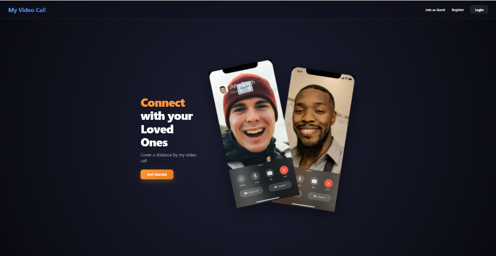
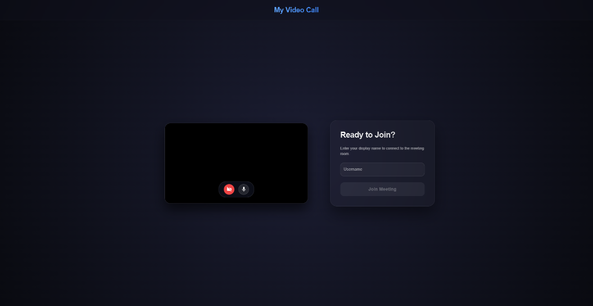
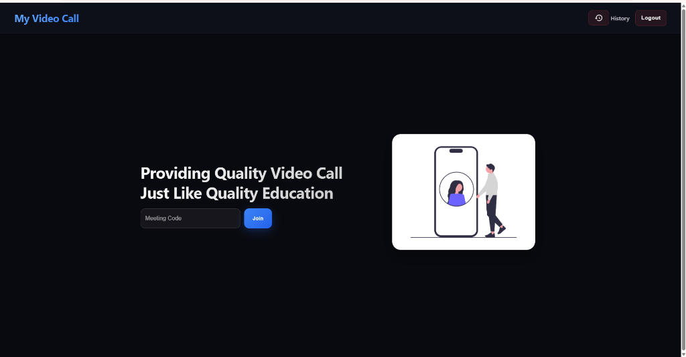
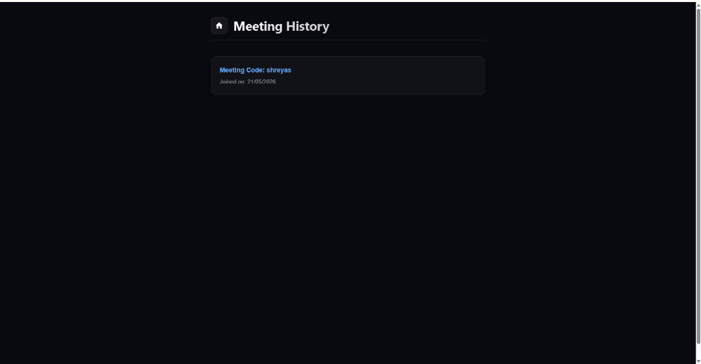

# Cosmic Video Call - Premium WebRTC Video Meeting Platform

A high-fidelity, premium cosmic-themed WebRTC video meeting application built with React, Node.js, Express, Socket.io, and MongoDB. The application offers a beautifully styled, high-performance interface with real-time video grids, chat boxes, session lobby controls, and hardware-accelerated layouts.

---

## 📸 Interface Screenshots

### 1. Landing Dashboard
A stunning cosmic dark space background featuring dynamic brand logos with floating keyframe animations, sleek navigation, and direct access controls.


### 2. Pre-Meeting Lobby
Google Meet-style side-by-side pre-call configuration screen. Test your camera and microphone status in the mirrored live preview frame using interactive toggle buttons before joining.


### 3. Secure Authentication
Frosted glass forms with elegant side-by-side graphics offering streamlined SignUp and SignIn processes.


### 4. Join Meeting & Dashboard
Enter your meeting code in a clean, glassmorphic input field on the dashboard to immediately host or join video rooms.


### 5. Meeting History
Track all your previous video calls in a responsive, glowing grid of glassmorphic history cards with date-joined stamps.


---

## ✨ Features

* **Cosmic Theme Aesthetics**: Global variables-driven premium theme featuring deep radial space gradients, glassmorphism overlays, and elegant glowing animations.
* **Pre-Meeting Lobby**: Google Meet-style split layout where users can check their live mirrored media preview, toggle audio/video inputs with status-changing glowing icons, and enter their name.
* **Hardware-Accelerated Grid Layouts**: Responsive grids that automatically arrange remote streams. Transitions have been removed from the layout containers to enable instant dimension calculations, ensuring WebRTC media feeds resize flawlessly without any flickering or stuttering when the chat panel is toggled.
* **Real-time Chat Integration**: Session-specific text messaging. Previous logs are automatically cleared both on the client state and the backend memory once the meeting ends (when active room users hit 0) to ensure complete session privacy.
* **Peer-to-Peer Username Exchange**: Socket.io signaling protocols dynamically bind actual usernames to remote participants' video frames, eliminating generic ID placeholders.
* **History Dashboard**: A dedicated panel listing call logs in glassmorphic cards with responsive hover states and clean text descriptions.

---

## 🛠️ System Architecture & Technology Stack

* **Frontend**:
  * **React.js** (Functional components, hooks, custom state management)
  * **Material-UI** (High-quality icon sets, text fields, buttons)
  * **Vanilla CSS / CSS Modules** (Premium custom cosmic styling system)
  * **Socket.io-client** & **WebRTC (RTCPeerConnection)** (Dynamic stream exchange and media handshakes)
* **Backend**:
  * **Node.js** & **Express** (Secure REST APIs, routing, server configuration)
  * **Socket.io** (Real-time events, WebRTC signaling orchestrator)
  * **MongoDB** & **Mongoose** (Persistent user accounts, secure authentication, and meeting histories)

---

## 🚀 Getting Started

### Prerequisites
* [Node.js](https://nodejs.org/) installed (v16+ recommended)
* [MongoDB](https://www.mongodb.com/) running locally or an active Atlas connection string

### Installation

1. **Clone the Repository**:
   ```bash
   git clone <repository-url>
   cd Zoom
   ```

2. **Backend Setup**:
   ```bash
   cd backened
   npm install
   ```
   * Create a `.env` file or let it default to port `8080` and connection string `mongodb://127.0.0.1:27017/videoCall`.

3. **Frontend Setup**:
   ```bash
   cd ../frontened
   npm install
   ```

### Running the Application

1. **Start the backend server**:
   ```bash
   cd backened
   npm start
   ```
   * The server runs on `http://localhost:8080` and initializes MongoDB connection.

2. **Start the frontend application**:
   ```bash
   cd ../frontened
   npm run dev
   ```
   * The React development server compiles and serves the application on `http://localhost:3000`.

3. **Open in Browser**:
   * Visit `http://localhost:3000` to register, log in, view history, or jump directly into a custom video room path (e.g. `http://localhost:3000/room-code`).
